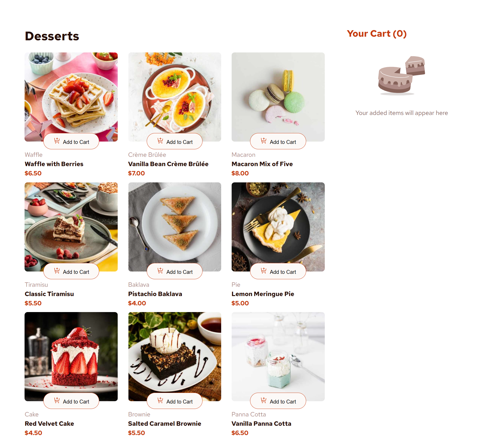
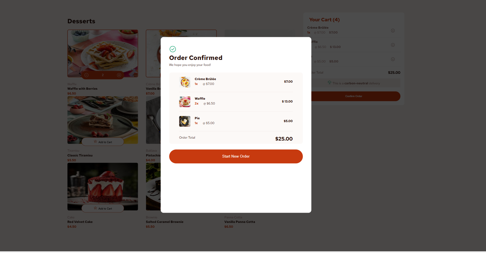

# Dessert Shop — Votre boutique 🛒


Ce projet est une simple page web de boutique de desserts qui affiche différents produits sucrés et permet aux utilisateurs d’ajouter des articles au panier. Le site est construit avec HTML, CSS et JavaScript. Il présente plusieurs desserts avec description, prix, et une option pour ajouter les articles au panier.

# Fonctionnalités

- Ajouter et retirer des articles dans le panier
- Augmenter/diminuer le nombre d'articles dans le panier
- Voir une fenêtre de confirmation de commande lorsqu'ils cliquent sur "Confirmer la commande"
- Réinitialiser leurs sélections lorsqu'ils cliquent sur "Commencer une nouvelle commande"

# Technologies utilisées

- HTML5 : pour structurer la page web.
- CSS3 : pour le style, la mise en page, les polices, et la présentation des produits.
- JavaScript : pour ajouter de l’interactivité, notamment la fonctionnalité « Ajouter au panier ».

# Structure du projet

```
/Dessert Shop
│
├── design/              # Dossier contenant les fichiers de design
│
├── Projet/             # Dossier contenant les fichiers du projet
│   ├── index.html      # Page HTML principale
│   ├── style.css       # Feuille de style pour la mise en page
│   ├── script.js       # Logique JavaScript
│   ├── images/         # Images des produits et icônes du panier
│
└── README.md           # Documentation
```

# Installation et utilisation

Pour exécuter ce projet localement :

Clonez le dépôt :

git clone https://github.com/Fatima-Zohra-Jaber/Product-list-with-cart

Accédez au dossier du projet :

Ouvrez le fichier index.html dans votre navigateur pour voir la page web.

# Captures d’écran

Voici un aperçu de la façon dont les produits sont présentés sur la page web :


